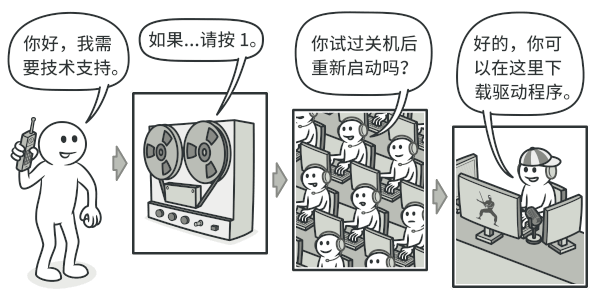
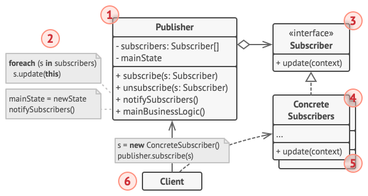
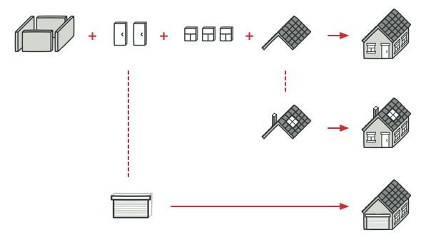

# 行为型模式

**行为模式负责对象间的高效沟通和职责委派。**

## 责任链模式

**亦称：** 职责链模式、命令链、CoR、Chain of Command、Chain of Responsibility



<center ><p style="color:#A8A8A8">给技术支持打电话时你可能得应对多名接听人员</p> </center> 

- 内容：使多个对象都有机会处理请求，从而避免请求的发送者和接收者之间的耦合关系。将这些对象连成一条链，并沿着这条链传递该请求，知道有一个对象处理它为止。
- 角色：
  - 抽象处理者（Handler）
  - 具体处理者（Concrete Handler）
  - 客户端（Client）
- 适用场景：
  - 有多个对象可以处理一个请求，哪个对象处理由运行是决定
  - 在不明确接收者的情况下，向多个对象中的一个提交一个请求
- 优点：
  - 降低耦合度：一个对象无需知道是其他哪一个对象处理其请求

​	**责任链模式结构**


```python
from abc import ABCMeta,abstractmethod

# 抽象处理者
class Handler(metaclass=ABCMeta):
    @abstractmethod
    def handle_leave(self, day):
        pass

# 具体处理者
class GeneralManager(Handler):
    def handle_leave(self, day):
        if day <= 10:
            print('总经理准假%d天' % day)
        else:
            print('你还是辞职吧！')

class DepartmentManager(Handler):
    def __init__(self):
        self.__next = GeneralManager()

    def handle_leave(self, day):
        if day <= 7:
            print('部门经理准假%d天' % day)
        else:
            self.__next.handle_leave(day)

class ProjectDirector(Handler):
    def __init__(self):
        self.__next = DepartmentManager()

    def handle_leave(self, day):
        if day <= 3:
            print('项目主管准假%d天' % day)
        else:
            self.__next.handle_leave(day)

# Client
handler = ProjectDirector()
handler.handle_leave(11)
```


## 观察者模式

**亦称：** 事件订阅者、监听者、Event-Subscriber、Listener、Observer


<center ><p style="color:#A8A8A8">杂志和报纸订阅</p> </center>

- 内容：定义对象间的一种一对多的依赖关系，当一个对象的状态发生变化时，所有依赖于它的对象都得到通知并被自动更新。观察者模式又称“发布-订阅”模式
- 角色：
  - 抽象主题（Subject）
  - 具体主题（Concrete Subject） --- 发布者
  - 抽象观察者（Observer）
  - 具体观察者（Concrete Observer）---订阅者
- 适用场景：
  - 当一个抽象模型有两方面，其中一个方面依赖于另一个方面。将这两者封装在独立对象中以使它们可以各自独立地改变和复用。
  - 当一个对象的改变需要同时改变其它对象，而不知道具体有多少对象有待改变。
  - 当一个对象必须通知其它对象，而它又不能假定其它对象是谁。换言之，你不希望这些对象是紧密耦合的。
- 优点：
  - 目标和观察者之间的抽象耦合最小
  - 支持广播通信

**观察者模式结构**



```python
from abc import ABCMeta, abstractmethod

# 抽象订阅者
class Observer(metaclass=ABCMeta):
    # notice是一个Notice类的对象
    def update(self, notice):
        pass

# 抽象发布者
class Notice:
    def __init__(self):
        self.observer = []

    def attach(self, obs):
        self.observer.append(obs)

    def detach(self, obs):
        self.observer.remove(obs)
    # 推送
    def notify(self):
        for obs in self.observer:
            obs.update(self)

# 具体发布者
class StaffNotice(Notice):
    def __init__(self, company_info = None):
        super().__init__()
        self.__company_info = company_info

    @property
    def company_info(self):
        return self.__company_info

    @company_info.setter
    def company_info(self, info):
        self.__company_info = info
        # 推送
        self.notify()

# 具体订阅者        
class Staff(Observer):
    def __init__(self):
        self.company_info = None

    def update(self, notice):
        self.company_info = notice.company_info

# Client
notice = StaffNotice("初始化公司")
s1 = Staff()
s2 = Staff()
notice.attach(s1)
notice.attach(s2)
notice.company_info = '明天公司放假！！！'
print(s1.company_info)
print(s2.company_info)
```


## 策略模式

**亦称：** Strategy


<center ><p style="color:#A8A8A8">各种前往机场的出行策略</p> </center> 

- 内容：定义一系列的算法，把它们一个个封装起来，并且使它们可相互替换。本模式使得算法可独立于使用它的客户而变化。
- 角色：
  - 抽象策略（Strategy）
  - 具体策略（Concrete Strategy ）
  - 上下文（Context）
- 优点：
  - 定义了一系列可重用的算法和行为
  - 消除了一些条件语句
  - 可以提供相同行为的不同实现
- 缺点：
  - 客户必须了解不同的策略

**策略模式结构**


```python
from abc import ABCMeta,abstractmethod

# 抽象策略
class Strategy(metaclass=ABCMeta):
    @abstractmethod
    def execute(self, data):
        pass

# 具体策略
class FastStrategy(Strategy):
    def execute(self, data):
        print("用较快的策略处理%s" % data)

class SlowStrategy(Strategy):
    def execute(self, data):
        print("用较慢的策略处理%s" % data)

# 上下文
class Context:
    def __init__(self, strategy, data):
        self.data = data
        self.strategy = strategy

    def set_strategy(self, strategy):
        self.strategy = strategy

    def do_strategy(self):
        self.strategy.execute(self.data)

# Client
data = '[...]'
s1 = FastStrategy()
s2= SlowStrategy()

context = Context(s1,data)
context.do_strategy()
context.set_strategy(s2)
context.do_strategy()
```


## 模板方法模式

**亦称：** Template Method



<center ><p style="color:#A8A8A8">可对典型的建筑方案进行微调以更好地满足客户需求</p> </center> 

- 内容：定义一个操作中的算法的骨干，而将一些步骤延迟到子类中。模板方法使得子类可以不改变一个算法的结构即可重定义该算法的某些特定步骤。
- 角色：
  - 抽象类（Abstract Class）：定义抽象的原子操作（钩子操作）；实现一个模板方法作为算法的骨架。
  - 具体类（Concrete Class）：实现原子操作
- 适用场景：
  - 一次性实现一个算法的不变的部分
  - 各个子类中的公共行为应该被提取出来并集中到一个公共父类中以避免代码重复
  - 控制子类扩展


**模板方法模式结构**


```python
from abc import ABCMeta, abstractmethod
from time import sleep

class Window(metaclass=ABCMeta):
    @abstractmethod
    def start(self):
        pass

    @abstractmethod
    def repaint(self):
        pass

    @abstractmethod
    def stop(self): # 原子操作/钩子操作
        pass

    def run(self):  # 模板方法
        self.start()
        while True:
            try:
                self.repaint()
                sleep(1)
            except KeyboardInterrupt:
                break
        self.stop()

class MyWindow(Window):
    def __init__(self, msg):
        self.msg = msg

    def start(self):
        print("窗口开始运行")

    def stop(self):
        print("窗口结束运行")

    def repaint(self):
        print(self.msg)

# 客户端        
MyWindow("Hello...").run()
```

