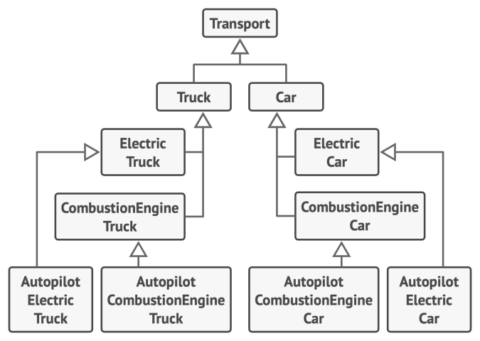
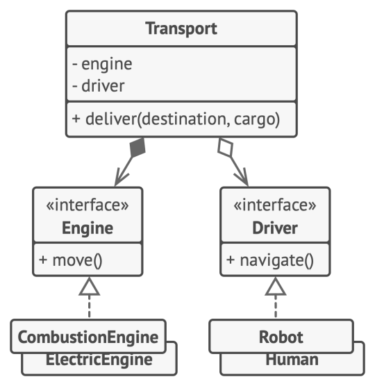

## 设计模式(Design Patterns)

- 设计模式：对**软件设计**中普遍存在（反复出现）的各种问题，所提出的解决方案。每一个设计模式系统的命名、解释和评价了**面向对象系统**中一个重要的和重复出现的设计。
- ”四人帮“（Gan of Four, GoF）：
  - Erich Gamma,Richard Helm,Ralph Johnson,John Vlissides

- 《设计模式：可复用面向对象软件的基础》

  

## 面向对象(Object Oriented Programming)

### 面向对象的三大特性

- 封装：在Class内部，可以有属性和方法，二外部代码可以通过直接调用实列变量的方法来操作数据，隐藏内部的复杂逻辑。
- 继承：在OOP程序设计中，定义一个class的时候，可以从某个现有的class继承，新的class称为子类，而被继承的class称为父类、基类。
- 多态：当子类和父类存在相同的方法时，子类的方法覆盖父类的方法，在代码运行时，总是会调用子类的方法。

### 接口(Interface)

接口：若干抽象方法的集合。

- 作用：限制实现接口的类必须按照接口给定的调用方法实现，这些方法；对高层模块隐藏了类的内部实现。

**继承实现接口**

```python
class Payment:
    def pay(self, money):
        raise NotImplementedError

class Alipay(Payment):
    def pay(self, money):
        print('支付宝支付了%d元' % money)

class Wechatpay(Payment):
    def pay(self, money):
        print('微信支付了%d元' % money)
```

**抽象类(abstract)实现接口**

```python
from abc import ABCMeta, abstractmethod

# 抽象类
class Payment(metaclass=ABCMeta):
    # abstract class 
    @abstractmethod
    def pay(self,money):
        pass

class Alipay(Payment):
    def pay(self, money):
        print('支付宝支付了%d元' % money)

class Wechatpay(Payment):
    def pay(self, money):
        print('微信支付了%d元' % money)
```

### 组合优于继承

继承可能是类之间最明显、最简单的代码复用方式。不过继承这件事通常只有在程序中已包含大量类,且修改任何东西都非常困难时才会引起关注。

- 子类不能减少超类的接口
- 在重写方法时，需要确保新行为与其基类中的版本兼容
- 继承打破了超类的封装
- 子类与超类紧密耦合
- 通过继承复用代码可能导致平行继承体系的产生



**继承：在多个维度上扩展一个类可能会导致子类组合的数量暴增。**



**组合：将不同“维度”的功能抽取到各自的类层次结构中。**


## 面向对象设计SOLID原则

### 开放封闭原则（Open Closed Principle）

一个软件实体如类、模块和函数应该**对扩展开放，对修改闭合**。即软件实体应尽量在不修改原有代码的情况下进行扩展。

### 里氏替换原则（Liskov Substitution principle）

所有引用父类的地方必须能**透明地使用其子类的对象**。

```python
# 子类和父类方法内部实现逻辑可能不同，但参数和返回值类型都是一致的
class User:
    def show_name(self,name):
        print(name)

class VIPUser(User):
    def show_name(self,name):
        print(name)
```


### 依赖倒置原则（Dependence Inversion Principle）

高层模块不应该依赖底层模块，二者都应该依赖其抽象；抽象不应该依赖细节；细节应该依赖抽象。换言之，**要面向接口编程，而不是面向实现编程**。

```python
from abc import ABCMeta, abstractmethod

# 抽象
class Payment(metaclass=ABCMeta):
    # abstract class 
    @abstractmethod
    def pay(self):
        pass

# 细节
class Alipay(Payment):
    def pay(self, money):
        print('支付宝支付了%d元' % money)

class Wechatpay(Payment):
    def pay(self, money):
        print('微信支付了%d元' % money)
```

### 接口隔离原则（Interface Segregation Principle）

使用多个专门的接口，而不使用单一的总接口，即**客户端不应该依赖那些它不需要的接口**

```python
from abc import ABCMeta, abstractmethod

class LandAnimal(metaclass=ABCMeta):
    @abstractmethod
    def walk(self):
        pass

class WaterAnimal(metaclass=ABCMeta):
    @abstractmethod
    def swim(self):
        pass

class SkyAnimal(metaclass=ABCMeta):
    @abstractmethod
    def fly(self):
        pass

class Tiger(LandAnimal):
    def walk(self):
        print('老虎在走路...')

# 多继承
class Frag(LandAnimal,WaterAnimal):
    def walk(self):
        print('青蛙在走路...')
    def swim(self):
        print('青蛙在游泳...')

frag = Frag()
frag.swim()
frag.walk()
```


### 单一职责原则（Single Responsibility Principle）

不要存在多于一个导致类变更的原因。通俗的说，即**一个类只负责一项职责**。


## 设计模式分类

### 创建型模式

**提供创建对象的机制，增加已有代码的灵活性和可复用性。**

- 工厂方法模式
- 抽象工厂模式
- 创建者模式
- 原型模式
- 单列模式

### 结构型模式

**如何将对象和类组装成较大的结构，并同时保持结构的灵活和高效。**

- 适配器模式
- 桥模式
- 组合模式
- 装饰器模式
- 外观模式
- 享元模式
- 代理模式

### 行为型模式

**负责对象间高效沟通和职责委派。**

- 解释器模式
- 责任链模式
- 命令模式
- 迭代器模式
- 中介者模式
- 备忘录模式
- 观察者模式
- 状态模式
- 策略模式
- 访问者模式
- 模板方法模式
